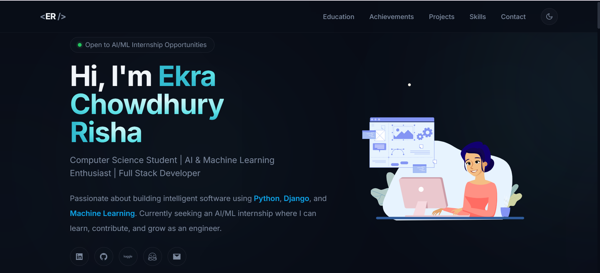

# 🌸 Ekra Chowdhury Risha - Portfolio

A modern, responsive portfolio website showcasing my projects, technical skills, education, achievements, and experience as a Computer Science student passionate about Artificial Intelligence, Machine Learning, and Full Stack Development.

🔗 **Live Website:** https://ekrachowdhuryrisha.vercel.app

---

## 👩‍💻 About Me

Hi! I'm **Ekra Chowdhury Risha**, a Computer Science & Engineering undergraduate at the **University of Asia Pacific (UAP), Bangladesh**.

I enjoy building intelligent software using modern technologies and continuously learning about:

- 🤖 Artificial Intelligence
- 🧠 Machine Learning
- 🐍 Python Development
- 🌐 Full Stack Web Development
- 💡 Software Engineering

I'm currently seeking **Software Engineering** and **AI/ML Internship** opportunities where I can apply my knowledge while continuing to grow.

---

# 🚀 Tech Stack

### Frontend
- React
- TypeScript
- Vite
- Tailwind CSS
- HTML5
- CSS3
- JavaScript

### Backend
- Python
- Django
- REST APIs

### AI / Machine Learning
- Google Gemini API
- LangChain
- Retrieval-Augmented Generation (RAG)

### Database
- MySQL

### Tools
- Git
- GitHub
- VS Code
- Canva

---

# ✨ Features

- Responsive Design
- Dark / Light Theme
- Smooth Animations (Framer Motion)
- Interactive Navigation
- Custom Cursor
- Modern UI
- Download Resume
- Project Showcase
- Skills Section
- Education Timeline
- Achievements Section
- Contact Section

---

# 📂 Featured Projects

## 1️⃣ UAP Bot by RAG

**Tech Stack:** Python • Streamlit • LangChain • Google Gemini API

An AI-powered chatbot for the University of Asia Pacific that uses **Retrieval-Augmented Generation (RAG)** to answer university-related questions from official documents with accurate, contextual responses.

### Features

- Retrieval-Augmented Generation (RAG)
- Google Gemini Integration
- LangChain Pipeline
- University Document Search
- Streamlit Interface

🔗 Repository:
https://github.com/Ekrachowdhuryrisha/uap-bot

---

## 2️⃣ Bachelor Point

**Tech Stack:** Django • Python • HTML • CSS • JavaScript • MySQL

A full-stack multi-vendor web platform designed to simplify student accommodation and daily services.

### Features

- Bachelor Accommodation System
- Food Supplier Module
- House Owner Module
- Student Dashboard
- Email OTP Verification
- Authentication System
- Booking Management
- Integrated AI Chatbot for user assistance using Google Gemini API

---

## 3️⃣ VaxMate

**Tech Stack:** Python • Django • MySQL • HTML • CSS • JavaScript

A vaccination management system that helps users manage vaccination schedules and medical records.

### Features

- Vaccination Schedule Management
- Reminder System
- User Authentication
- Vaccination Record Tracking
- MySQL Database

🔗 Repository:
https://github.com/Ekrachowdhuryrisha/VaxMate

---

## 4️⃣ Personal Portfolio Website

**Tech Stack:** React • TypeScript • Vite • Tailwind CSS • Framer Motion

A modern responsive portfolio website built from scratch to showcase my technical skills, projects, education, and achievements.

### Features

- Responsive Design
- Dark Mode
- Smooth Animations
- Interactive UI
- Project Showcase
- Resume Download
- Contact Section

Repository:
Current Repository

---

# 📸 Portfolio Preview




---

# ⚙️ Installation

Clone the repository

```bash
git clone https://github.com/Ekrachowdhuryrisha/-portfolio_ekrachowdhuryrisha-.git
```

Go into the project directory

```bash
cd -portfolio_ekrachowdhuryrisha-
```

Install dependencies

```bash
npm install
```

Run locally

```bash
npm run dev
```

Build for production

```bash
npm run build
```

Preview production build

```bash
npm run preview
```

---

# 📬 Contact

**Ekra Chowdhury Risha**

📧 Email:
ekrachowdhuryrisha@gmail.com

💼 LinkedIn:
https://www.linkedin.com/in/ekra-chowdhury-risha

💻 GitHub:
https://github.com/Ekrachowdhuryrisha

🌐 Portfolio:
https://ekrachowdhuryrisha.vercel.app 

---

# 📄 License

This project is open-source and available under the MIT License.

---
